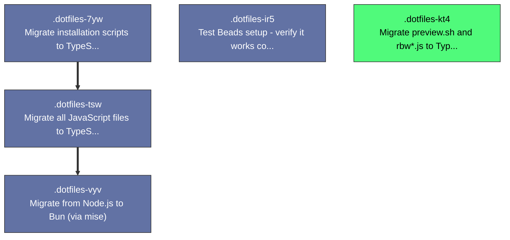

# Beads Export

*Generated: Mon, 26 Jan 2026 20:32:54 IST*

## Summary

| Metric | Count |
|--------|-------|
| **Total** | 5 |
| Open | 1 |
| In Progress | 0 |
| Blocked | 0 |
| Closed | 4 |

## Quick Actions

Ready-to-run commands for bulk operations:

```bash
# Close all open items
bd close .dotfiles-kt4

```

## Table of Contents

- [🟢 .dotfiles-kt4 Migrate preview.sh and rbw*.js to TypeScript](#dotfiles-kt4-migrate-preview-sh-and-rbw-js-to-typescript)
- [⚫ .dotfiles-7yw Migrate installation scripts to TypeScript (Bun)](#dotfiles-7yw-migrate-installation-scripts-to-typescript-bun)
- [⚫ .dotfiles-tsw Migrate all JavaScript files to TypeScript](#dotfiles-tsw-migrate-all-javascript-files-to-typescript)
- [⚫ .dotfiles-vyv Migrate from Node.js to Bun (via mise)](#dotfiles-vyv-migrate-from-node-js-to-bun-via-mise)
- [⚫ .dotfiles-ir5 Test Beads setup - verify it works correctly](#dotfiles-ir5-test-beads-setup-verify-it-works-correctly)

---

## Dependency Graph



---

<a id="dotfiles-kt4-migrate-preview-sh-and-rbw-js-to-typescript"></a>

## 📋 .dotfiles-kt4 Migrate preview.sh and rbw*.js to TypeScript

| Property | Value |
|----------|-------|
| **Type** | 📋 task |
| **Priority** | 🔹 Medium (P2) |
| **Status** | 🟢 open |
| **Created** | 2026-01-26 20:29 |
| **Updated** | 2026-01-26 20:29 |

### Description

Migrate shell and JavaScript scripts in bin/ folder to TypeScript with Bun runtime, consistent with the installation scripts migration.

Files to migrate:
- bin/preview.sh → preview.ts
- bin/rbw*.js → rbw*.ts (all rbw-related JavaScript files)

Follow cleanCode and cleanTypes principles.

<details>
<summary>📋 Commands</summary>

```bash
# Start working on this issue
bd update .dotfiles-kt4 -s in_progress

# Add a comment
bd comment .dotfiles-kt4 'Your comment here'

# Change priority (0=Critical, 1=High, 2=Medium, 3=Low)
bd update .dotfiles-kt4 -p 1

# View full details
bd show .dotfiles-kt4
```

</details>

---

<a id="dotfiles-7yw-migrate-installation-scripts-to-typescript-bun"></a>

## 📋 .dotfiles-7yw Migrate installation scripts to TypeScript (Bun)

| Property | Value |
|----------|-------|
| **Type** | 📋 task |
| **Priority** | 🔹 Medium (P2) |
| **Status** | ⚫ closed |
| **Created** | 2026-01-26 12:01 |
| **Updated** | 2026-01-26 19:41 |
| **Closed** | 2026-01-26 19:41 |

### Description

Migrate entire installation system to TypeScript with Bun runtime. Only bootstrap.sh remains in bash (needed for initial curl | bash setup on fresh machines).

Scripts to migrate to TypeScript (.sh → .ts):
1. installation/install.sh - Main installation orchestrator
2. installation/dependencies.sh - Handles mise/Homebrew dependencies
3. installation/system.sh - System configuration
4. installation/macos-defaults.sh - macOS defaults configuration
5. installation/logging.sh - Logging utilities
6. installation/verify.sh - Installation verification
7. installation/test-install.sh - VM testing script
8. installation/links.js - Already JavaScript, will be TypeScript

Files that stay as bash:
- installation/bootstrap.sh (first-time setup, must be bash for curl | bash)

Dependencies:
- Blocked by .dotfiles-tsw (need all JS→TS migration done first, including links.js)

Benefits:
- Type safety for installation logic
- Better error handling
- Easier to test and maintain
- Consistent language across codebase
- Bun's native TypeScript support = no build step

Tasks:
1. Convert each .sh script to .ts
2. Replace bash-specific logic with TypeScript/Bun equivalents
3. Use Bun APIs for shell commands, file operations
4. Update bootstrap.sh to call install.ts instead of install.sh
5. Test installation end-to-end in VM

### Dependencies

- ⛔ **blocks**: `.dotfiles-tsw`

---

<a id="dotfiles-tsw-migrate-all-javascript-files-to-typescript"></a>

## 📋 .dotfiles-tsw Migrate all JavaScript files to TypeScript

| Property | Value |
|----------|-------|
| **Type** | 📋 task |
| **Priority** | 🔹 Medium (P2) |
| **Status** | ⚫ closed |
| **Created** | 2026-01-26 11:52 |
| **Updated** | 2026-01-26 19:26 |
| **Closed** | 2026-01-26 19:26 |

### Description

Migrate all JavaScript files to TypeScript to improve type safety and maintainability. Bun supports TypeScript natively, so no build step needed.

Files to migrate:
1. installation/links.js - Symlinking logic
2. bin/inspect - Developer tool for opening devtools

Both files currently use #!/usr/bin/env node shebang which needs to change to #!/usr/bin/env bun.

Dependencies:
- Blocked by .dotfiles-vyv (need Bun installed via mise first)

Tasks:
1. Rename .js files to .ts
2. Add TypeScript types
3. Update shebangs from node to bun
4. Test all scripts work with Bun runtime

### Dependencies

- ⛔ **blocks**: `.dotfiles-vyv`

---

<a id="dotfiles-vyv-migrate-from-node-js-to-bun-via-mise"></a>

## 📋 .dotfiles-vyv Migrate from Node.js to Bun (via mise)

| Property | Value |
|----------|-------|
| **Type** | 📋 task |
| **Priority** | 🔹 Medium (P2) |
| **Status** | ⚫ closed |
| **Created** | 2026-01-26 11:40 |
| **Updated** | 2026-01-26 12:29 |
| **Closed** | 2026-01-26 12:29 |

### Description

Currently using Node.js for installation scripts and developer tools. Want to migrate to Bun for better performance and simpler runtime management through mise.

Files with Node.js shebangs (#!/usr/bin/env node):
1. installation/links.js - Symlinking logic for dotfiles
2. bin/inspect - Developer tool for opening devtools

Tasks:
1. Add bun to mise config
2. Update dependencies.sh to install bun via mise instead of Node.js
3. Update shebangs from node to bun
4. Verify both scripts work with bun runtime
5. Update any documentation referencing Node.js
6. Test installation script end-to-end

### Notes

Dependency: Other tasks depend on this completing first (TypeScript migration needs Bun runtime)

---

<a id="dotfiles-ir5-test-beads-setup-verify-it-works-correctly"></a>

## 📋 .dotfiles-ir5 Test Beads setup - verify it works correctly

| Property | Value |
|----------|-------|
| **Type** | 📋 task |
| **Priority** | 🔹 Medium (P2) |
| **Status** | ⚫ closed |
| **Created** | 2026-01-26 11:28 |
| **Updated** | 2026-01-26 11:28 |
| **Closed** | 2026-01-26 11:28 |

---

