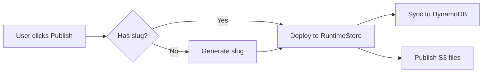

# Bead Writing Conventions

Load this skill before writing or updating bead descriptions (`bd update --description`, `bd create --description`).

## Markdown Table Alignment

All markdown tables MUST have columns padded to consistent widths. This is critical for readability in neovim and terminal viewers that render markdown as-is.

### Bad (unaligned)

```
| Caller | File:Line | Status |
|--------|-----------|--------|
| Password reset | runtime_api.py:714 | THEORETICAL |
| WhatsApp redirect | app_agents/runtime_api.py:246 | THEORETICAL |
```

### Good (aligned)

```
| Caller            | File:Line                      | Status      |
|-------------------|--------------------------------|-------------|
| Password reset    | runtime_api.py:714             | THEORETICAL |
| WhatsApp redirect | app_agents/runtime_api.py:246  | THEORETICAL |
```

### Rules

1. **Pad every cell** to the width of the longest value in that column
2. **Pad the separator row** (`|---|`) to match column widths
3. **Use trailing spaces** to align the closing `|` on every row
4. **Left-align** all content (no centering with `:---:`)
5. **Keep header text short** — if a header is longer than most values, consider abbreviating

### How to Apply

When constructing a table string for `bd update --description`:
1. Collect all rows first
2. Calculate max width per column
3. Pad each cell with spaces to that width
4. Then build the final markdown string

## Inline Source Attribution

When a bead's description contains conclusions, findings, or action items that originate from other beads, cite the source bead(s) inline so readers can `bd show <cited-id>` to dig deeper.

### Format

After each section's content, list source beads on their own lines:

```
<full-bead-id> -> <short reason why this bead is relevant>
```

### Rules

1. **Use full bead IDs** — no short keys or abbreviations. The ID must be directly usable with `bd show`
2. **Place after the section content** — not inline within sentences, not in a separate section at the bottom
3. **Include a short reason** — a few words explaining what this source contributes to the conclusion
4. **One line per source** — each source bead gets its own line with its own reason
5. **Keep the Source Beads section** at the bottom as a quick-reference index

### Example

```markdown
### Runtime Store — NO CHANGE NEEDED

Designed to support null slugs. `APP#{app_id}` entry written regardless;
`DOMAIN#{slug}` only if slug exists.

- **Status**: NO CHANGE NEEDED

apper-research-runtime-store -> DynamoDB single-table design, defensive null checks in write/delete

### Frontend — 8 REAL Risks

Fresh audit of all 68 `.slug` references found 8 unguarded locations.

| File          | Risk     | What Breaks                        |
|---------------|----------|------------------------------------|
| domains.ts    | CRITICAL | 3 URL functions produce undefined  |
| AppDomains.js | HIGH     | SlugEditor shows broken URL        |

apper-research-fe-audit-v2 -> found InviteUserModal (missed by first pass)
apper-research-fe-check-v1 -> items 1-6 (thorough frontend check)
```

## Mermaid Diagrams

Use mermaid diagrams in bead descriptions when they clarify context or intention — for both agents consuming the bead and humans reading it.

**Good uses:**
- Lifecycle/state flows (e.g., app states: created -> building -> published)
- Dependency graphs between components or phases
- Request/data flow through multiple services
- Decision trees for implementation approaches

**Don't use when:**
- A simple bullet list or table conveys the same information
- The diagram would have fewer than 3 nodes
- The relationship is purely linear with no branching

### Example

````markdown
## Publish Flow


````

## Other Bead Formatting

- Use `##` headers to separate major sections
- Use `###` for subsections within findings
- Code blocks: use triple backticks with language identifier
- Keep lines under 120 characters where possible
- Use `**bold**` sparingly — for key terms, status labels, and emphasis only
