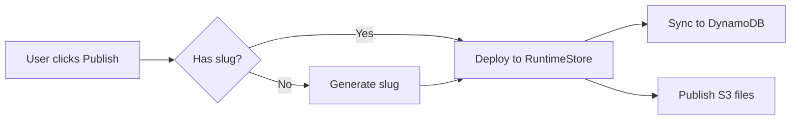

# Bead Writing Conventions

Load this skill before any `bd create` or `bd update` call.

## NEVER GUESS — Accuracy is Mandatory

Everything written into a bead MUST be correct and verified. Beads are persistent project memory — wrong information pollutes future sessions and misleads other agents.

**Rules:**

1. **Do NOT guess** file paths, line numbers, function names, variable names, error messages, or any factual claim
2. **Do NOT fabricate** bead IDs, status values, dependency relationships, or statistics
3. **Research first** — read the code, run the command, check the file before writing claims about them
4. **Ask the user** if you cannot verify something and cannot research it yourself
5. **Omit rather than guess** — if you can't confirm a detail, leave it out. A bead with fewer verified facts is better than one with fabricated details

**Examples of violations:**

- Writing `auth.py:142` without reading the file to confirm line 142
- Claiming "3 callers found" without actually searching and counting
- Referencing `myapp-research-auth` as a parent without checking it exists via `bd show`
- Describing behavior of code you haven't read

**When unsure:** Stop and ask the user. Do NOT fill in blanks with plausible-sounding content.

## Bead ID Naming

Use semantic IDs with the project prefix: `<prefix>-<category>-<descriptive-name>`

Discover the prefix from existing beads:
```bash
bd list --limit 1  # Look at existing bead IDs
```

**Category is a short, descriptive slug for the bead's role.** Examples:

```
myapp-epic-auth
myapp-research-auth-login
myapp-summary-auth
myapp-review-opt-auth
myapp-impl-auth-session
myapp-code-review-auth
myapp-manual-qa-auth
myapp-final-auth
```

Pick a category that makes the bead's purpose obvious from the ID alone. Check existing beads (`bd list`) to stay consistent with categories already in use.

## Parent-Child Structure

Use sub-epics to organize phases under a main epic:
```bash
# Main epic
bd create "Lazy slug generation" --id myapp-epic-lazy-slug --type epic

# Sub-epics for phases
bd create "Research: lazy slug" --id myapp-research-lazy-slug --type epic --parent myapp-epic-lazy-slug
bd create "Implementation: lazy slug" --id myapp-impl-lazy-slug --type epic --parent myapp-epic-lazy-slug

# Research beads under the research sub-epic
bd create "Backend slug generation" --id myapp-research-lazy-slug-backend-gen --parent myapp-research-lazy-slug
bd create "Frontend null guards" --id myapp-research-lazy-slug-frontend-guards --parent myapp-research-lazy-slug

# Impl beads under the impl sub-epic
bd create "Remove slug validator" --id myapp-impl-lazy-slug-remove-validator --parent myapp-impl-lazy-slug
```

**All flags work together in a single command.** Always combine `--id`, `--parent`, `--type`, etc. in one call:
```bash
# CORRECT — one command with all flags
bd create "Session mgmt" --id myapp-research-auth-session --parent myapp-research-auth --type task

# WRONG — do NOT split into create + update
bd create "Session mgmt" --id myapp-research-auth-session
bd update myapp-research-auth-session --parent myapp-epic-auth  # unnecessary
```

## Markdown Table Alignment

All markdown tables MUST have columns padded to consistent widths. This is critical for readability in neovim and terminal viewers that render markdown as-is.

### Bad (unaligned)

```
| Caller | File:Line | Status |
|--------|-----------|--------|
| Password reset | runtime_api.py:714 | THEORETICAL |
| WhatsApp redirect | app_agents/runtime_api.py:246 | THEORETICAL |
```

### Good (aligned)

```
| Caller            | File:Line                      | Status      |
|-------------------|--------------------------------|-------------|
| Password reset    | runtime_api.py:714             | THEORETICAL |
| WhatsApp redirect | app_agents/runtime_api.py:246  | THEORETICAL |
```

### Rules

1. **Pad every cell** to the width of the longest value in that column
2. **Pad the separator row** (`|---|`) to match column widths
3. **Use trailing spaces** to align the closing `|` on every row
4. **Left-align** all content (no centering with `:---:`)
5. **Keep header text short** — if a header is longer than most values, consider abbreviating

### How to Apply

When constructing a table string for `bd update --description`:
1. Collect all rows first
2. Calculate max width per column
3. Pad each cell with spaces to that width
4. Then build the final markdown string

## Inline Source Attribution

When a bead's description contains conclusions, findings, or action items that originate from other beads, cite the source bead(s) inline so readers can `bd show <cited-id>` to dig deeper.

### Format

After each section's content, list source beads on their own lines:

```
<full-bead-id> -> <short reason why this bead is relevant>
```

### Rules

1. **Use full bead IDs** — no short keys or abbreviations. The ID must be directly usable with `bd show`
2. **Place after the section content** — not inline within sentences, not in a separate section at the bottom
3. **Include a short reason** — a few words explaining what this source contributes to the conclusion
4. **One line per source** — each source bead gets its own line with its own reason
5. **Keep the Source Beads section** at the bottom as a quick-reference index

### Example

```markdown
### Runtime Store — NO CHANGE NEEDED

Designed to support null slugs. `APP#{app_id}` entry written regardless;
`DOMAIN#{slug}` only if slug exists.

- **Status**: NO CHANGE NEEDED

apper-research-runtime-store -> DynamoDB single-table design, defensive null checks in write/delete

### Frontend — 8 REAL Risks

Fresh audit of all 68 `.slug` references found 8 unguarded locations.

| File          | Risk     | What Breaks                        |
|---------------|----------|------------------------------------|
| domains.ts    | CRITICAL | 3 URL functions produce undefined  |
| AppDomains.js | HIGH     | SlugEditor shows broken URL        |

apper-research-fe-audit-v2 -> found InviteUserModal (missed by first pass)
apper-research-fe-check-v1 -> items 1-6 (thorough frontend check)
```

## Mermaid Diagrams

Use mermaid diagrams in bead descriptions when they clarify context or intention — for both agents consuming the bead and humans reading it.

**Good uses:**
- Lifecycle/state flows (e.g., app states: created -> building -> published)
- Dependency graphs between components or phases
- Request/data flow through multiple services
- Decision trees for implementation approaches

**Don't use when:**
- A simple bullet list or table conveys the same information
- The diagram would have fewer than 3 nodes
- The relationship is purely linear with no branching

### Example

````markdown
## Publish Flow


````

## File Path References

When referencing source files in bead descriptions, use **git-root-relative paths** with line numbers. This enables `gd` navigation from bead detail buffers directly to the source code.

### Format

- Single line: `path/to/file.py:42`
- Line range: `path/to/file.py:330-335`

### Rules

1. **Always use git-root-relative paths** — not just filenames, not absolute paths
2. **Verify the path exists** — run `ls` or `find` before writing it into a bead
3. **Verify line numbers are accurate** — read the file to confirm what's at that line
4. **Include line ranges** when the relevant code spans multiple lines — `gd` will highlight the range
5. **Always keep path and lines together** as `path:line` or `path:line-line` — never split them into separate table columns. The `gd` keymap parses `file:line` as a single token.

### Bad

```
app_core.py:330          ← filename only, ambiguous
/Users/me/projects/apper/backend/app/models/app_core.py:330  ← absolute path, not portable

| File         | Lines   | Change              |
|--------------|---------|---------------------|
| app_core.py  | 330-335 | Remove validator    |  ← path and lines in separate columns, gd can't parse
```

### Good

```
backend/app/user_apps/common/models/app_core.py:330-335
backend/app/user_apps/common/models/app_core.py:266
```

### In Tables

```
| Location                                                        | Change                                  |
|-----------------------------------------------------------------|-----------------------------------------|
| backend/app/user_apps/common/models/app_core.py:330-335         | Remove `ensure_slug_exists` validator   |
| backend/app/user_apps/builder/chat/on_message_callback.py:16-34 | Remove proactive slug generation        |
```

## Other Bead Formatting

- Use `##` headers to separate major sections
- Use `###` for subsections within findings
- Code blocks: use triple backticks with language identifier
- Keep lines under 120 characters where possible
- Use `**bold**` sparingly — for key terms, status labels, and emphasis only
