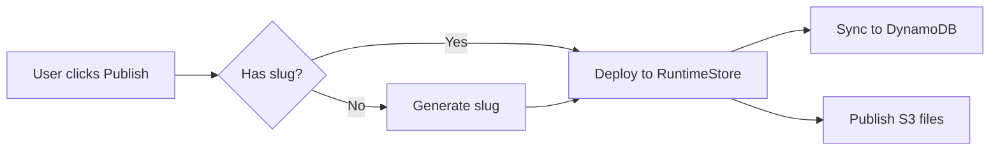
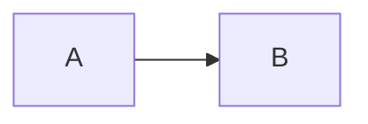

# Bead Writing Conventions

## NEVER GUESS — Accuracy is Mandatory

Everything written into a bead MUST be correct and verified. Beads are persistent project memory — wrong information pollutes future sessions and misleads other agents.

**Rules:**

1. **Do NOT guess** file paths, line numbers, function names, variable names, error messages, or any factual claim
2. **Do NOT fabricate** bead IDs, status values, dependency relationships, or statistics
3. **Research first** — read the code, run the command, check the file before writing claims about them
4. **Ask the user** if you cannot verify something and cannot research it yourself
5. **Omit rather than guess** — if you can't confirm a detail, leave it out. A bead with fewer verified facts is better than one with fabricated details

**Examples of violations:**

- Writing `auth.py:142` without reading the file to confirm line 142
- Claiming "3 callers found" without actually searching and counting
- Referencing `myapp-research-auth` as a parent without checking it exists via `bd show`
- Describing behavior of code you haven't read

**When unsure:** Stop and ask the user. Do NOT fill in blanks with plausible-sounding content.

## Command Syntax — COPY THIS EXACTLY

**CRITICAL: `--id` and `--parent` are MUTUALLY EXCLUSIVE.** You cannot use both in the same command. `bd create` will error with `Error: cannot specify both --id and --parent flags`.

To create a bead with a custom ID under a parent, use `--deps parent-child:<parent-id>`:

```bash
# Standalone bead with custom ID (no parent)
bd create "Title here" --id myapp-impl-auth --type task

# Bead with custom ID AND a parent — use --deps, NOT --parent
bd create "Title here" --id myapp-impl-auth-session --type task --deps parent-child:myapp-epic-auth

# Epic with custom ID (no parent)
bd create "Title here" --id myapp-epic-auth --type epic

# Child epic under parent epic — use --deps, NOT --parent
bd create "Title here" --id myapp-research-auth --type epic --deps parent-child:myapp-epic-auth
```

**Key rules:**
- `--id` sets the bead ID (use the naming convention below)
- `--deps parent-child:<parent-id>` sets the parent (parent must already exist)
- `--parent` is for auto-numbered children ONLY (generates dotted IDs like `bd-a3f8e9.1`) — do NOT use it with `--id`
- `--type` sets task|bug|feature|epic|chore (default: task)
- Always combine `--id`, `--deps`, `--type`, etc. in one call

## Summary Section (Required)

Every bead description MUST start with a `## Summary` section — 1-3 sentences explaining the bead's purpose and key outcome. This enables selective context loading: explorers and readers can skim summaries without loading full descriptions.

**Rules:**

1. **MUST be the first `##` section** in the description
2. **1-3 sentences max** — what this bead is about and what it concluded/decided
3. **No code blocks, tables, or references** in the summary — plain text only
4. **For epics**: describe the goal and scope
5. **For research**: state the question and the answer
6. **For impl**: describe what was built and why

**Example:**

```markdown
## Summary

Add selective context loading to the sussBead skill so LLMs can skim bead hierarchies via summaries instead of loading full descriptions. Introduces bd-section and bd-explore scripts.

## Detailed Design
...
```

## Bead ID Naming

Use semantic IDs with the project prefix: `<prefix>-<category>-<descriptive-name>`

Discover the prefix from existing beads:
```bash
bd list --limit 1  # Look at existing bead IDs
```

**Category is a short, descriptive slug for the bead's role.** Examples:

```
myapp-epic-auth
myapp-research-auth-login
myapp-summary-auth
myapp-review-opt-auth
myapp-impl-auth-session
myapp-code-review-auth
myapp-manual-qa-auth
myapp-final-auth
```

Pick a category that makes the bead's purpose obvious from the ID alone. Check existing beads (`bd list`) to stay consistent with categories already in use.

## Parent-Child Structure

Use sub-epics to organize phases under a main epic. Since `--id` and `--parent` can't be combined, use `--deps parent-child:<parent-id>`:

```bash
# Main epic (no parent)
bd create "Lazy slug generation" --id myapp-epic-lazy-slug --type epic

# Sub-epics for phases (parent = the main epic)
bd create "Research: lazy slug" --id myapp-research-lazy-slug --type epic --deps parent-child:myapp-epic-lazy-slug
bd create "Implementation: lazy slug" --id myapp-impl-lazy-slug --type epic --deps parent-child:myapp-epic-lazy-slug

# Research beads under the research sub-epic
bd create "Backend slug generation" --id myapp-research-lazy-slug-backend-gen --deps parent-child:myapp-research-lazy-slug
bd create "Frontend null guards" --id myapp-research-lazy-slug-frontend-guards --deps parent-child:myapp-research-lazy-slug

# Impl beads under the impl sub-epic
bd create "Remove slug validator" --id myapp-impl-lazy-slug-remove-validator --deps parent-child:myapp-impl-lazy-slug
```

**Common mistakes:**
```bash
# WRONG — --id and --parent are mutually exclusive, this ERRORS
bd create "Session mgmt" --id myapp-research-auth-session --parent myapp-research-auth

# WRONG — unnecessary two-step
bd create "Session mgmt" --id myapp-research-auth-session
bd dep add myapp-research-auth-session myapp-research-auth --type parent-child

# CORRECT — one command with --deps
bd create "Session mgmt" --id myapp-research-auth-session --type task --deps parent-child:myapp-research-auth
```

## Markdown Table Alignment

All markdown tables MUST have columns padded to consistent widths. This is critical for readability in neovim and terminal viewers that render markdown as-is.

### Bad (unaligned)

```
| Caller | File:Line | Status |
|--------|-----------|--------|
| Password reset | runtime_api.py:714 | THEORETICAL |
| WhatsApp redirect | app_agents/runtime_api.py:246 | THEORETICAL |
```

### Good (aligned)

```
| Caller            | File:Line                      | Status      |
|-------------------|--------------------------------|-------------|
| Password reset    | runtime_api.py:714             | THEORETICAL |
| WhatsApp redirect | app_agents/runtime_api.py:246  | THEORETICAL |
```

### Rules

1. **Pad every cell** to the width of the longest value in that column
2. **Pad the separator row** (`|---|`) to match column widths
3. **Use trailing spaces** to align the closing `|` on every row
4. **Left-align** all content (no centering with `:---:`)
5. **Keep header text short** — if a header is longer than most values, consider abbreviating

### How to Apply

When constructing a table string for `bd update --description`:
1. Collect all rows first
2. Calculate max width per column
3. Pad each cell with spaces to that width
4. Then build the final markdown string

## Authorship Tracking (Footer)

**Every bead update MUST include authorship tracking in the footer.** This enables tracing which agents or sessions created or modified each bead, critical for debugging workflows and improving agent instructions.

### Format

Add to the **bottom of every bead description** after all content:

```markdown
---
**Created by**: <agent-name> (2026-02-11 10:23)
**Updated by**: <agent-name-1> (2026-02-11 14:45), <agent-name-2> (2026-02-11 16:12)
```

### Rules

1. **Always at the bottom** — after all content
2. **Horizontal rule first** — start with `---` to visually separate from content
3. **Created by** — agent/session name + timestamp (YYYY-MM-DD HH:MM format)
4. **Updated by** — comma-separated list of updates, each with agent name + timestamp
5. **Context-aware naming**:
   - **If running as an agent** (spawned via Task tool): Use your agent name (e.g., `domain-researcher-auth`, `architect`, `synthesizer`)
   - **If normal Claude Code session** (no team/agent context): Use `claude-code-session`
   - **If unclear/unknown**: Use `claude-code`

### When to Update

- **On `bd create`**: Add `Created by` line
- **On `bd update`**: Append to `Updated by` line (don't remove previous entries)

### Example

```markdown
## Findings

<bead content here...>

---
**Created by**: architect (2026-02-11 09:15)
**Updated by**: domain-researcher-auth (2026-02-11 11:30), depth-auth (2026-02-11 14:22)
```

### Detection Logic

```python
# Pseudo-logic for determining agent name
if agent_context_available:
    agent_name = get_agent_name_from_context()  # e.g., "domain-researcher-auth"
elif running_in_team:
    agent_name = "claude-code-session"
else:
    agent_name = "claude-code-session"
```

This is **best-effort tracking** for debugging and workflow improvement, not strict auditing.

## Inline Source Attribution

When a bead's description contains conclusions, findings, or action items that originate from other beads, cite the source bead(s) inline so readers can navigate to the exact section for deeper context.

### Format

After each section's content, list source beads on their own lines:

```
<full-bead-id>#<section-slug> -> <short reason why this bead is relevant>
```

The `#section-slug` is a kebab-case slug matching a `##` or `###` heading in the target bead. This enables `gd` navigation in the Neovim beads viewer to jump directly to that section.

### Slug Rules

1. Strip the leading `#` characters and whitespace from the heading
2. Lowercase everything
3. Replace spaces, colons, and special characters with hyphens
4. Collapse consecutive hyphens into one
5. Trim leading/trailing hyphens

**Examples:**

| Heading in target bead                  | Slug                                |
|-----------------------------------------|-------------------------------------|
| `## Key Findings: URL Handling`         | `key-findings-url-handling`         |
| `### Frontend — 8 REAL Risks`           | `frontend-8-real-risks`             |
| `## Q1: Backend file_urls Processing`   | `q1-backend-file-urls-processing`   |

### Rules

1. **Use full bead IDs** — no short keys or abbreviations. The ID must be directly usable with `bd show`
2. **Include `#section-slug`** — the slug MUST match a `##` or `###` heading in the target bead. Verify the heading exists before writing the reference
3. **Place after the section content** — not inline within sentences
4. **Do NOT collect references in a footer section** — every reference MUST appear inline after the content it supports. No `## Source Beads` or `## References` section at the bottom
5. **Include a short reason** — a few words explaining what this source contributes
6. **One line per source** — each source bead gets its own line with its own reason

### Example

```markdown
### Runtime Store — NO CHANGE NEEDED

Designed to support null slugs. `APP#{app_id}` entry written regardless;
`DOMAIN#{slug}` only if slug exists.

- **Status**: NO CHANGE NEEDED

apper-research-runtime-store#url-handling -> DynamoDB single-table design, defensive null checks in write/delete

### Frontend — 8 REAL Risks

Fresh audit of all 68 `.slug` references found 8 unguarded locations.

| File          | Risk     | What Breaks                        |
|---------------|----------|------------------------------------|
| domains.ts    | CRITICAL | 3 URL functions produce undefined  |
| AppDomains.js | HIGH     | SlugEditor shows broken URL        |

apper-research-fe-audit-v2#frontend-8-real-risks -> found InviteUserModal (missed by first pass)
apper-research-fe-check-v1#slug-reference-audit -> items 1-6 (thorough frontend check)
```

### Bad — footer collection (PROHIBITED)

```markdown
## Findings
Some conclusion about auth...
Some other conclusion about frontend...

## Source Beads
- apper-research-auth-backend -> backend session handling
- apper-research-auth-frontend -> React auth hooks
```

This loses traceability. You can't tell which finding came from which bead.

## Mermaid Diagrams

Use mermaid diagrams in bead descriptions when they clarify context or intention — for both agents consuming the bead and humans reading it.

**Good uses:**
- Lifecycle/state flows (e.g., app states: created -> building -> published)
- Dependency graphs between components or phases
- Request/data flow through multiple services
- Decision trees for implementation approaches

**Don't use when:**
- A simple bullet list or table conveys the same information
- The diagram would have fewer than 3 nodes
- The relationship is purely linear with no branching

### MUST: Validate Before Writing

**Every mermaid block MUST be validated before writing it into a bead.** Use the `bd-validate-mermaid` script:

```bash
# Validate a single diagram string
~/.claude/skills/sussBead/scripts/bd-validate-mermaid --string 'graph LR
    A --> B --> C'

# Validate all mermaid blocks in the body-file before bd create/update
~/.claude/skills/sussBead/scripts/bd-validate-mermaid /tmp/bead-desc.md
```

If validation fails, fix the syntax before writing. Never write a bead with an unvalidated mermaid block.

### Common Syntax Pitfalls

**Colons in labels** — The `#1` cause of mermaid failures. In `stateDiagram-v2`, `flowchart`, and `sequenceDiagram`, the `:` character is a label delimiter. A colon inside your label text (e.g., `file.js:42`) is parsed as a second delimiter, breaking the diagram.

```
BAD:  A --> B: AppContext.js:28 stores raw appId     ← :28 parsed as second label
GOOD: A --> B: AppContext.js line 28 stores raw appId ← no ambiguous colon
GOOD: A --> B: "AppContext.js:28 stores raw appId"    ← quoted (flowchart/sequence only)
```

**Special characters in labels** — These characters cause parse errors in various diagram types:

| Character           | Problem                        | Fix                          |
|---------------------|--------------------------------|------------------------------|
| `:` (colon)         | Label delimiter collision      | Remove or rephrase           |
| `${}` (template)    | Parsed as variable syntax      | Use plain text description   |
| `//` (double slash)  | Comment-like in some contexts  | Spell out "protocol-relative"|
| `<` `>` (angles)    | HTML/tag parsing               | Use `&lt;` `&gt;` or remove |
| `()` in node names  | Parsed as node shape           | Use `[]` or avoid in IDs     |

**Rule of thumb:** Keep mermaid labels to plain English. Move technical details (file paths, code snippets, URL patterns) into a table or bullet list outside the diagram.

### Example

````markdown
## Publish Flow


````

## File Path References

When referencing source files in bead descriptions, use **git-root-relative paths** with line numbers. This enables `gd` navigation from bead detail buffers directly to the source code.

### Format

- Single line: `path/to/file.py:42`
- Line range: `path/to/file.py:330-335`

### Rules

1. **Always use git-root-relative paths** — not just filenames, not absolute paths
2. **Verify the path exists** — run `ls` or `find` before writing it into a bead
3. **Verify line numbers are accurate** — read the file to confirm what's at that line
4. **Include line ranges** when the relevant code spans multiple lines — `gd` will highlight the range
5. **Always keep path and lines together** as `path:line` or `path:line-line` — never split them into separate table columns. The `gd` keymap parses `file:line` as a single token.

### Bad

```
app_core.py:330          ← filename only, ambiguous
/Users/me/projects/apper/backend/app/models/app_core.py:330  ← absolute path, not portable

| File         | Lines   | Change              |
|--------------|---------|---------------------|
| app_core.py  | 330-335 | Remove validator    |  ← path and lines in separate columns, gd can't parse
```

### Good

```
backend/app/user_apps/common/models/app_core.py:330-335
backend/app/user_apps/common/models/app_core.py:266
```

### In Tables

```
| Location                                                        | Change                                  |
|-----------------------------------------------------------------|-----------------------------------------|
| backend/app/user_apps/common/models/app_core.py:330-335         | Remove `ensure_slug_exists` validator   |
| backend/app/user_apps/builder/chat/on_message_callback.py:16-34 | Remove proactive slug generation        |
```

## Shell Escaping — Backticks in Descriptions

**Pitfall:** Do NOT escape backticks with `\` in `--description`. Single-quoted strings treat `\` as literal, so `--description='...\`\`\`mermaid...'` stores `\`\`\`mermaid` — breaking mermaid and code blocks.

**What works (tested):**

```bash
# Double quotes — shell interprets \` as ` (WORKS)
bd create "Title" --description="## Diagram

\`\`\`mermaid
graph LR
    A --> B
\`\`\`
"

# --body-file — safest, no escaping needed (WORKS)
cat <<'BEAD_EOF' > /tmp/bead-desc.md
## Diagram


BEAD_EOF
bd create "Title" --body-file /tmp/bead-desc.md
```

**What breaks:**

```bash
# Single quotes with backslash-backtick — \ is literal, stored as \` (BROKEN)
bd create "Title" --description='```mermaid ...\`\`\`'
```

**Rules:**
1. **Prefer `--body-file`** for descriptions with code fences — no escaping to think about
2. **Double quotes work** but require `\`` for each backtick
3. **Never use `\`` inside single quotes** — the `\` is stored literally

## Other Bead Formatting

- Use `##` headers to separate major sections
- Use `###` for subsections within findings
- Code blocks: use triple backticks with language identifier
- Keep lines under 120 characters where possible
- Use `**bold**` sparingly — for key terms, status labels, and emphasis only
